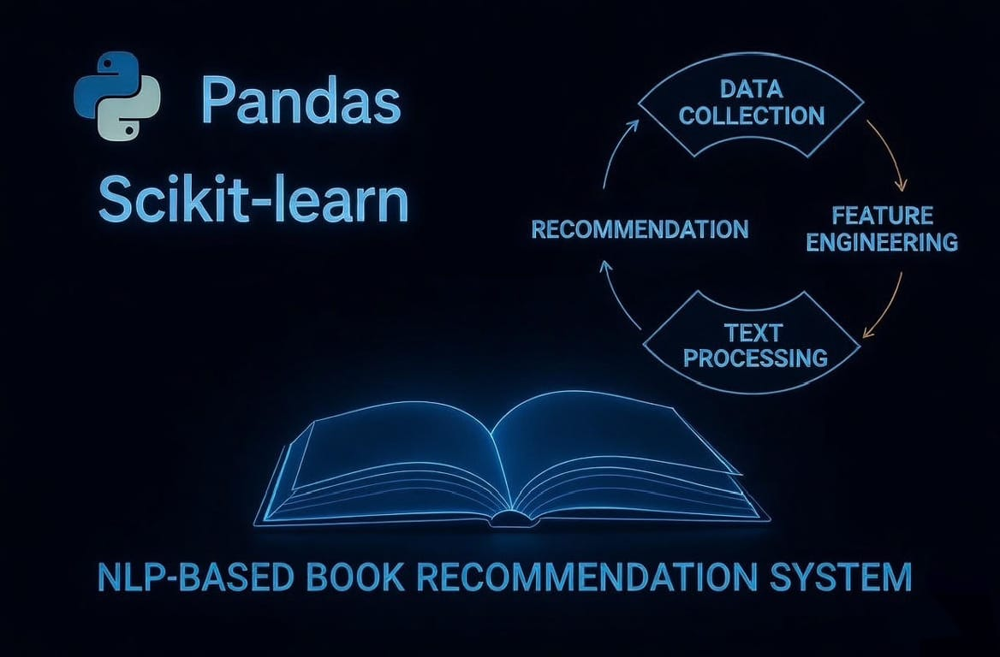
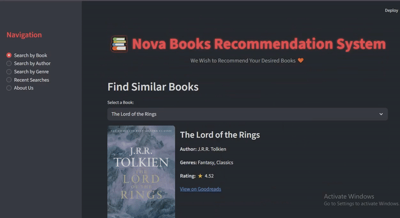
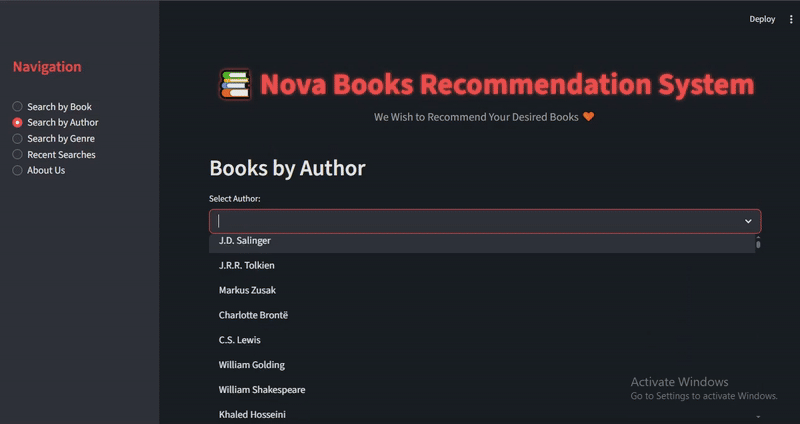

```markdown
# Nova Books Recommendation System 2025
### NLP-Based Content Recommender Using TF-IDF & Cosine Similarity

<div align="center">
  
</div>

<div align="center">

[](https://python.org)
[](https://scikit-learn.org)
[](https://streamlit.io)
[](LICENSE)

</div>

---

## Project Overview

The **Nova Books Recommendation System** is a content-based recommender built using **TF-IDF** and **cosine similarity** (via `linear_kernel`).  
Its purpose is to help users discover new books similar to the ones they already enjoy.

Unlike collaborative filtering, this system does **not require user histories or ratings**.  
Instead, it analyzes the actual content of each book — title, author, description, and genres — to find meaningful similarities.

This project is ideal for:

- Personalized book discovery without user data
- Learning **NLP-based recommendation systems** with TF-IDF
- Exploring real-time cover image integration
- Building a fully deployable, responsive **Streamlit** web app

---

## Why This Project Matters

Book lovers often struggle to find their next read. Traditional platforms rely on popularity or ratings, but many hidden gems go unnoticed.

Nova Books introduces a **content-driven, intelligent discovery tool** that matches books based on semantic similarity — perfect for niche tastes.

**Key problems solved**  
- Over-reliance on popularity/ratings  
- Difficulty finding books with similar "vibe" or themes  
- Lack of simple, fast, content-focused recommenders  
- Slow manual searching across platforms  

**Who benefits**  
- Avid readers looking for hidden gems  
- Students learning NLP & recommendation systems  
- Developers building content-based search tools  
- Book clubs & librarians  

---

## Live Web App

<div style="padding:10px; font-size:100%; text-align:left;">
    URL: 
    <a href="https://nova-books-recommender.streamlit.app/" target="_blank">
        Click here for Nova Books Recommender
    </a>
</div>

---

## App Demo (Animations & Interactions)

<div align="center">
  
  <p><em>Search by book title and get instant similar recommendations with hover animations</em></p>
</div>

<div align="center">
  
  <p><em>Browse all books by your favorite author with pagination</em></p>
</div>

---

## Dataset Overview — Global Book Insights Dataset

This project uses the **Global Book Insights Dataset**, a high-quality public dataset designed specifically for recommendation and NLP applications.

### **Entries**
- 10,000 books

### **Columns**

| Column              | Description                                      |
|---------------------|--------------------------------------------------|
| **Book**            | Title of the book                                |
| **Author**          | Name of the author                               |
| **Description**     | Summary of the book from Goodreads               |
| **Genres**          | One or multiple genres assigned to the book      |
| **Average Rating**  | Average Goodreads rating (0–5 scale)             |
|**Number of Ratings**| Total number of user ratings                     |
| **URL**             | Direct link to the Goodreads page                |

### **File Details**
- Format: CSV
- Size: ~11 MB
- Unique Titles: 9,871
- Unique Authors: 6,064
- Unique Descriptions: 9,889

### **Enhancement: Cover_URL Column**
The original dataset lacked book covers. I built a **hybrid scraper** (Goodreads → Google Books → Open Library) using multithreading to fetch high-quality covers for nearly all books — enabling beautiful visual cards in the app.

### **License**
- CC0 — completely free to use, modify, and distribute.

### **Dataset Link**
<div style="padding:10px; font-size:100%; text-align:left;">
    Used Dataset: 
    <a href="https://www.opendatabay.com/data/ai-ml/11680306-2393-422b-871a-2e57b673b6ac" target="_blank">
        Click here for the Global Book Insights Dataset (OpenDataBay)
    </a>
</div>

---

## Repository Structure
```text
.
📁 Books_Recommender_System/
├── Books_banner.jpeg                   ← Project banner
├── Books.gif                           ← App demo: Search by Book
├── Authors.gif                         ← App demo: Search by Author
├── README.md
├── LICENSE
├── .gitignore
├── requirements.txt
├── data/
│   ├── raw/
│   │   └── global_book_insights_10k.csv ← Original dataset
│   └── processed/
│       └── cleaned_books.csv           ← Cleaned + Cover_URL added
├── src/
│   ├── data_utils.py                   ← Dataset cleaning & processing
│   └── text_features.py                ← TF-IDF feature creation
├── models/
│   └── tfidf_features.pkl.gz           ← Compressed TF-IDF matrix + vectorizer + df
└── app/
    └── streamlit_app.py                ← Interactive Streamlit web app
```

---

## How It Works (Step-by-Step)

1. **Preprocessing & Cleaning**  
   - Remove duplicates, handle missing values  
   - Standardize text fields  

2. **Cover Image Enrichment**  
   - Hybrid scraper adds `Cover_URL` for visual appeal  

3. **Create Combined Text**  
   - Merge title + author + description + genres  

4. **TF-IDF Vectorization**  
   - Convert text to numerical vectors (max_features=4000, bigrams)  

5. **Similarity Calculation**  
   - Cosine similarity using `linear_kernel` for fast recommendations  

6. **Streamlit UI**  
   - Interactive search by book, author, or genre  
   - Hover animations on book cards  
   - Mobile-responsive design  

7. **Deployment Ready**  
   - Model compressed for Streamlit Cloud compatibility  

---

## Run Locally
```bash
git clone https://github.com/harisyar-ai/nova-books-recommender.git
cd nova-books-recommender
pip install -r requirements.txt
streamlit run app/streamlit_app.py
```

---

## Future Improvements

- Add BERT/Sentence Transformers for deeper semantic understanding  
- Implement user profiles & collaborative filtering hybrid  
- Include book previews or sample pages  
- Add "surprise me" random high-rated recommendations  
- Export recommendations as PDF/reading list  

---

                            December 2025
                 Developed by Muhammad Haris Afridi
              Stars & feedback are highly appreciated ⭐
  
                      github.com/harisyar-ai
